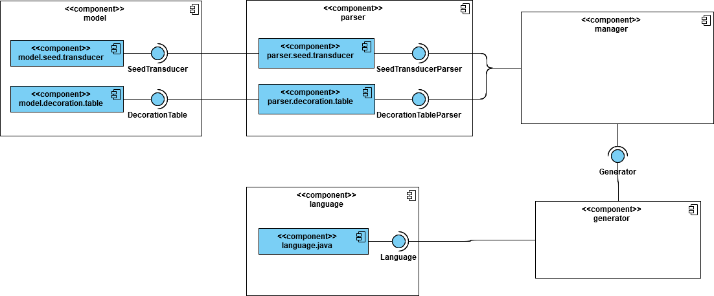
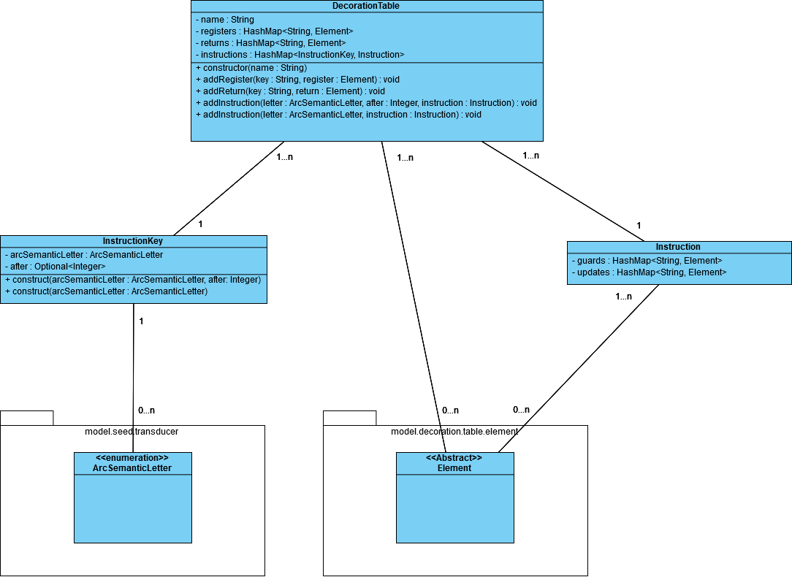
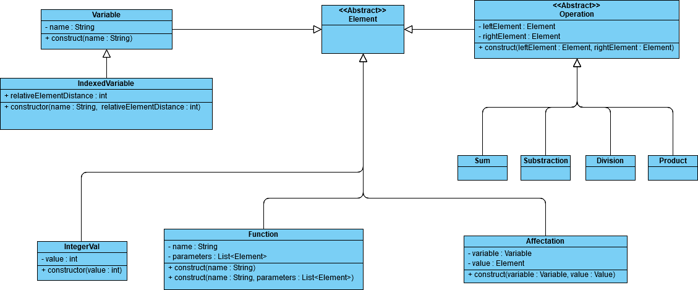
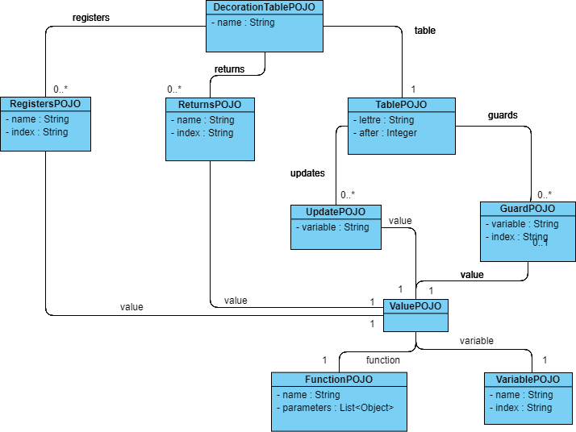
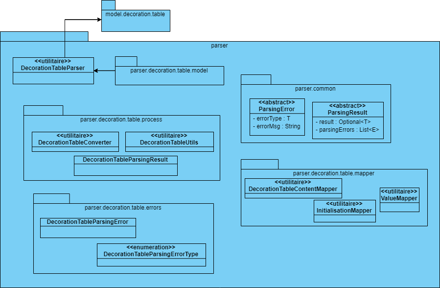

# Conception

## General

Cette application a été conçu modulaire, avec un couplage le plus faible possible entre les différents modules, pour pouvoir être ajoutés, supprimés ou remplacés facilement. On peut ainsi distinguer les modules suivantes :

#### Modèle (package model)

Ce module renferme l'implémentation des tables de décoration et des transduceurs. Il est la base sur laquelle tous les autres modules vont se greffer pour fonctionner.

#### Parseur (package parser)

Ce module contient les parseurs utilisés pour transformer les tables de décoration et transduceurs fournis via du JSON, en une instance du modèle.

#### Générateur (package generator)

Ce module contient les interfaces nécessaires pour pouvoir générer le code. Il est le module sur lequel tous les modules de génération vont hériter pour pouvoir offrir la même interface pour l'utilisateur. C'est via ce module qu'on génèrera le code.

#### Java (package language.java)

Ce module contient les classes pour générer le code JAVA du modèle. Il s'appuie sur le package `generator`, dont il tire l'interface.

#### Manager (package manager)

Ce module permet aux différents modules de fonctionner ensemble. Ainsi, il parse les fichiers d'entrée en utilisant `parser`, et génère le code via le module `generator` en lui envoyant l'instance de `model` créée.

Cette application est faite en sorte qu'on puisse ajouter des parseurs, si l'on veut instancier le modèle via un autre langage que le JSON, ou encore ajouter des générateurs, si l'on souhaite générer le code correspondant en un autre langage que le JAVA. L'architecture est schematisé ci-dessous :

Chaque module expose une classe utilitaire qui en constitue le point d'entrée.

## Modèle 

Le modèle est séparé en deux parties principales fortement liés. La première concerne le Transducteur, et la seconde la table de décoration.

### Transducteur

Le Transducteur est composé des classes java suivantes : 
- SeedTransducteur
- State
- Arc

ainsi que des énumérations suivantes :
- ArcSemanticLetter
- ArcOperator

Il représente un transducteur de la manière suivante : La classe **`SeedTransducteur`** possède son _`nom`_, la valeur de son _`before`_ et de son _`after`_, ses _`états`_ sous la forme d'une HasMap, avec comme clé le nom de l'état, ses _`arcs`_ sous la forme d'un HashSet, et enfin son _`état d'initialisation`_.

Les états, quand à eux, sont représentés dans la classe **`State`**, contenant leur _`nom`_.

Enfin, les arcs sont modélisés via la classe **`Arc`**, qui possède l'état de départ et l'état d'arrivée. Un arc est pondéré par un _`opérateur`_, représenté par l'énumération **`ArcOperator`**, et par une _`lettre sémantique`_ représentée par l'énumération **`ArcSemanticLetter`**.

#### Diagramme de classe de l'architecture d'un Transducteur :

### Table de décoration

La table de décoration est représentée principalement par la class **`DecorationTable`**, qui contient son _`nom`_, et _`registres`_ sous la forme d'une HashMap d'**`Element`** dont la clé est le nom du registre, et dont l'élement est la valeur à l'initialisation. Même procédé pour les variables _`returns`_. Les instructions sont, elles, définies dans une HashMap d'**`Instruction`** avec comme clé un objet **`InstructionKey`**.

Cet classe **`InstructionKey`** est composée de deux éléments, une _`Lettre Sémantique`_ (définie dans la partie prédédente) et d'une valeur (optionelle) pour l'_`after`_.

Les instructions sont implémentés par la classe **`Instruction`**. Cette classe est composée d'une HashMap d'**`Element`** représentant les guards, et dont la clé est l'identifiant de la variable modifiée, et d'une HashMap d'**`Element`** pour représenter les updates, fonctionnant de la même manière.

#### Diagramme de classe de l'architecture d'une Table de Décoration :

Concernant ces éléments : 

Un élément est un objet pouvant prendre plusieurs formes, de la variable jusqu'à un calcul en passant par une affectation. On peut ainsi les imbriquer pour former des expressions complexes, et les donner comme guard ou update dans une Table de décoration ou une Instruction.

Tous les élements héritent de la superclasse **`Element`**. On y retrouve une autre classe abstraite en héritant directement : **`Operation`**. Cette classe définit toutes les opérations comme fonction entre deux élements. En hérite : **`Somme`**, **`Soustraction`**, **`Produit`** et **`Division`**. Autre classe héritant directement de **`Element`** : **`Variable`**. Cette classe représente une variable, définie par son _`nom`_. Une variante existe, héritant de **`Variable`** : **`IndexedVariable`**. Cette classe représente une variable, avec un index, représenté par un attribut _`Distance relative`_, qui représente la distance entre l'index voulu et l'index courant. Ainsi, une variable v(i+1) sera notée IndexVariable("v", 1).

Enfin, on retrouve d'autres implémentations de **`Element`**, tels que **`IntegerVal`** représentant juste un integer, par sa _`valeur`_, **`Function`** qui représente une fonction par son _`nom`_ et ses _`paramètres`_ sous la forme d'une liste, et enfin **`Affectation`** qui associe un **`Element`** à une **`Variable`**.

#### Diagramme de classe de l'architecture des Elements :

## Module de parsing

Ce module se découpe en deux modules respectivement spécialisé dans le parsing du transducteur et de la table de décoration. 
Tout deuc produisent des objets résultats contenant les données parsée ainsi que les éventuelles erreurs. 

Ils présentent tout deux une indépendance totale.

### Table de décoration

#### Model

Le module de parse de la table de décoration prend en entrée un ficher JSON. Ce dernier est mappé 
automatiquement selon l'architecture suivante : 

### Architecture général du parser

Le diagramme suivant décrit l'architecture général du parser de table de décoration. Ce dernier est principalement constitué
de classes utilitaires :
 

#### Mappers

Trois mappers interviennent alors et vont utilisés pour transformer ces POJO en model (décrit précédement) utilisable par le générateur.
La classe utilitaire `DecorationTableContentMapper` permet de parser les données de la table de décoration dans son ensemble en se basant sur 
`InitialisationMapper` et `ValueMapper` respectivement chargés de mapper les données propres à l'initialisation (`name`, `registers` et `returns`)
et aux valeurs (tel que `variable`, `functions`,...).
C'est ici que les données sont également vérifiées et validées. 

#### Gestion des erreurs

Lorsque les données sont transformées en model, des erreurs peuvent être constatées tel que le mauvais typage de paramètre de fonction par exemple.
Les types d'erreurs sont toutes référencées dans l'énumération `DecorationTableParsingErrorType`. `DecorationTableParsingError` lie
le type d'erreur à un message adaptée à l'erreur constatée au cours du traitement.

Au moment où les données sont converties depuis le model POJO vers le model général, le converter `DecorationTableConverter` parse les données et 
remonte les éventuelles erreurs ou incohérences constatées via un object résultat `DecorationTableParsingResult`. Ce dernier comprend la table de décoration 
obtenue si aucune erreur n'a été constatée.

Il arrive qu'une ou plusieurs erreurs surviennent au cours du processus.
Si une erreur de parsing majeur survient, tel que la présence d'un champs non définit dans le JSON par exemple, le parsing s'arrête et l'utilisateur doit effectuer la correction.
S'il est question d'une erreur propres au données renseignées, tel que l'oublie d'un nom de variable par exemple, 
le problème est signalé mais le parsing se poursuit. Ainsi, à la fin du processus, l'utilisateur à une vision globale 
de toute les erreurs ou incohérences de son fichier JSON. Il peux alors effectuer l'ensemble des corrections sans avoir 
à relancer le processus et réitérer les corrections. 

### Transducteur

Le parser présente la classe utilitaire `SeedTransducerParser`. La seul méthode présentée fait appel au `SeedTransducerConverter` 
qui se charge du parsing du seed transducer. Le fichier JSON est alors ouvert et mapper à un POJO (`SeedTransducerPOJO`).
L'objet est alors analysé et transformé en `SeedTransducer`.

L'énumération `SeedTransducerJSONElements` resemble les éléments JSON attendu dans le fichier.
 
Le résultat de ce traitement est un objet `SeedTransducerParsingResult`. Ce dernier comprend l'objet `SeedTransduecr`
résultat et/ou les erreurs survenues. Si ces erreurs sont blocante, le parsing est arrêté et aucun objet
`SeedTransducer` ne sera produit. Dans le cas ou le mapping est fait, le POJO est alors analysé. Si des erreurs
ou incohérence sont constaté (état initial non présent dans la liste des états par exemple) ces erreurs
sont ajoutées au résultat. 

Les types d'erreurs sont centralisé dans une énumération `SeedTransducerParserErrorType`. Cela facilite la maintenance
et permet aussi une centralisation des messages d'erreurs. Il est donc facile de les adapter en cas de besoins ou 
de les traduires.

Cette implémentation renvoie ainsi un objet résultat et offre une indépendance certain de ce module. 
Il est aussi aisé de le remplacer par un autre en cas de besoin. 
Aussi si l'ont souhaite s'en servir dans un autre programme ou y brancher une interface graphique, tout les 
éléments sont disponible y compris les informations de traitement. 

### Points d'entrées

Chacun de ces deux modules de parsing propre au transducer ou à la table de décoration présente une classes utilitaires constituant le 
point d'entrée du module à savoir respectivement `DecorationTableParser` et `SeedTransducerParser`. 
Les fonctionnements et architectures sont similaires.

Les types d'erreurs sont centralisé dans des énumérations. Cela en facilite grandement la maintenance
via une centralisation des messages d'erreurs. Il est donc simple de les adapter en cas de besoins ou 
de les traduires.

Ces deux modules retournent des objets résultats. Ils sont tout deux indépendant et il est facile de remplacer l'un ou l'autre
(dans la mesure ou les protocoles de communication entre module sont respectés). 
Il est aussi aisé de le remplacer par un autre en cas de besoin. 
Aussi si l'ont souhaite s'en servir dans un autre programme ou y brancher une interface graphique, tout les 
éléments sont disponible y compris les informations de traitement, le résultat de parsing tout comme la liste des erreurs. 

## Module de génération

// Todo

## Module de génération Java

// Todo

## // TODO: Autres modules
