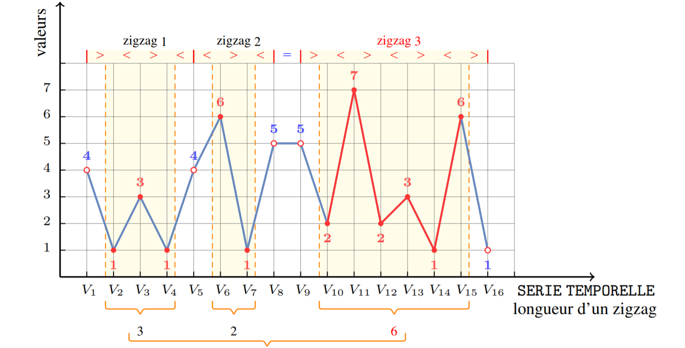

# Contexte

Une serie temporelle est une séquence d’entiers correspondant à des mesures effectuées
a intervalles réguliers. Les séries temporelles se rencontrent dans un grand nombre 
de domaines tels par exemple des mesures d’electricité produite par des stations, des
mesures de temperature, d’humidité ou de CO2 dans de grande infrastructures. Etant
donnée une série temporelle on calcule différentes caractéristiques telles que la hauteur 
du plus grand pic ou la longueur du plus long zigzag afin de detecter des similarités
entre plusieurs series temporelles ou des anomalies venant par exemple de capteurs
defectueux. La figure suivante illustre le calcul d’une telle caractéristique, à savoir la
longueur maximum d’un zigzag (un zigzag est une alternance stricte d’augmentation et
de diminution des valeurs de mesures consecutives). Comme il existe un nombre important
d’indicateurs calculables on s’interesse à une approche systématique pour calculer
des indicateurs sur des series temporelles.

## Description genérale

1. Le travail consistera dans un premier temps a comprendre l’article "Using Finite
Transducers for Describing and Synthesising Structural Time-Series Constraints
Constraints Journal 2015", de Nicolas Beldiceanu, Mats Carlsson, Remi Douence
et Helmut Simonis (<a href="http://google.com">https://link.springer.com/article/10.1007%2Fs10601-015-9200-3</a>).

2. Dans un deuxieme temps le travail consistera à implémenter un générateur de code 
genérant le code C, Java ou Python (au choix) des fonctions calculant les positions
de toutes les occurrences d’un patron donne dans une série temporelle, ainsi que,
par la suite, la valeur d’un feature donne pour toutes les occurrences d’un patron. et 
a tester votre code sur des séries temporelles qui vous seront fournies. Le processus 
de genération de code doit utiliser les tables de décorations qui vous seront fournies. 

3. Dans un troisieme temps vous utiliserez le code que vous avez généré pour extraire 
des informations sur des donnees de votre choix.
L’article mis a part, vous pouvez aussi consulter les transparents présentant cet article.

## Travail attendu

On attend une description du genérateur de code que vous avez implémenté, une justification
des choix que vous avez fait, ainsi que des arguments etayant la validité de votre
implementation et un commentaire sur l’utilisation que vous en avez faite pour analyser 
des données. 

## Liens

- Document de recherche
<a href="http://google.com">https://link.springer.com/article/10.1007%2Fs10601-015-9200-3</a>
