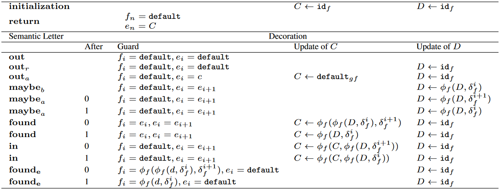

# Utilisation

## Lancer l'application

Pour lancer l'application, il faut renseigner 3 arguments au programme :
- Le chemin du fichier json ([syntaxe ici](SeedTransducer.md)) du transducteur ;
- Le chemin du fichier json ([syntaxe ici](DecorationTable.md)) de la table de décoration ;
- Le langage cible du code à générer, en l'état, seul Java est implémenté(renseigner : `Java` comme argument).

Un quatrième argument peut-être renseigné :
- Le chemin de dossier dans lequel générer le fichier.

Ces arguments doivent-êtres fournis dans cet ordre à la fonction `main` de `app.App`.

Pour les fournir :

**Eclipse :**

- Cliquer sur `Run` puis `Run Configuration`
- Selectionner `Java Application`
- Cliquer sur `Nouveau`
- Dans l'onglet `Arguments`, indiquer les arguments dans le champ de texte 
`Program Arguments`. Un argument par ligne.

Ajouter tout d'abord le chemin de votre fichier json du transducteur, puis passez une ligne, ajouter celui du fichier json de la table de décoration, puis repassez une ligne, notez le langage cible voulu,
Puis (optionel), passez une ligne, ajoutez le chemin de destination du fichier généré (de base : src/main/java/generated).

**IntelliJ:**
- Cliquer sur `run/debug configuration`
- Dans l'onglet `Configuration`, ajouter les arguments dans `Program arguments`

## Ajouter un langage de génération

Pour ajouter un langage de génération, trois étapes sont nécessaires :

Tout d'abord créer un module pour le nouveau langage en question. (Exemple: `language.python`)

Ensuite, créer la classe d'exposition de ce nouveau langage (Exemple : `langage.python.PythonGenerator`). Elle doit étendre `generator.LanguageGenerator`, et ainsi implémenter la fonction `StringBuffer generateCode(SeedTransducer seedTransducer, DecorationTable decorationTable)`, c'est le point d'entrée de la génération pour l'application.

Enfin, la dernière étape est d'enregistrer son langage dans l'énumération `generator.GeneratorAvailableLanguages` en y ajoutant votre langage en tant que nouvel element de cet énumération (Exemple : `PYTHON("Python", new PythonGenerator);`).

Votre langage est maintenant enregistré. Il vous reste à implémenter la génération de code correspondant dans votre nouveau module, à partir de la classe d'exposition que vous venez d'enregistrer.

Pour l'utiliser, il vous suffit d'appeller la fonction `process(String, String, String AvailableLanguages)` de la classe `manager.Manager` avec comme paramètres :
- Le chemin du fichier .json d'un Transducteur
- Le chemin du fichier .json d'une Table de Décoration
- Le chemin de destination du fichier généré
- La référence de votre nouveau langage (Exemple : `AvailableLanguages.PYTHON`)

## Modèle

### Instanciation d'un transducteur

Pour implémenter un transducteur, il faut utiliser le package `modele.seed.transducteur`.

Voici un exemple de comment instancier un transducteur (ici `PEAK`) :


```
// Instanciation de la classe d'exposition
SeedTransducer peak = new SeedTransducer("peak", 1, 0);

// Création des états
State d = new State("d");
State r = new State("r");
State t = new State("t");
      
// Création des arcs
Arc dd = new Arc();
dd.setFrom(d);
dd.setTo(d);
dd.setArcOperator(ArcOperator.GEQ);
dd.setArcSemanticLetter(ArcSemanticLetter.OUT);

Arc dr = new Arc();
dr.setFrom(d);
dr.setTo(r);
dr.setArcOperator(ArcOperator.LT);
dr.setArcSemanticLetter(ArcSemanticLetter.OUT);

Arc rr = new Arc();
rr.setFrom(r);
rr.setTo(r);
rr.setArcOperator(ArcOperator.LEQ);
rr.setArcSemanticLetter(ArcSemanticLetter.MAYBE_BEFORE);
        
Arc rt = new Arc();
rt.setFrom(r);
rt.setTo(t);
rt.setArcOperator(ArcOperator.GT);
rt.setArcSemanticLetter(ArcSemanticLetter.FOUND);

Arc tr = new Arc();
tr.setFrom(t);
tr.setTo(r);
tr.setArcOperator(ArcOperator.LT);
tr.setArcSemanticLetter(ArcSemanticLetter.OUT_AFTER);
        
Arc tt1 = new Arc();
tt1.setFrom(t);
tt1.setTo(t);
tt1.setArcOperator(ArcOperator.GT);
tt1.setArcSemanticLetter(ArcSemanticLetter.IN);
        
Arc tt2 = new Arc();
tt2.setFrom(t);
tt2.setTo(t);
tt2.setArcOperator(ArcOperator.EQ);
tt2.setArcSemanticLetter(ArcSemanticLetter.MAYBE_AFTER);

// Ajout des états
peak.addState(d);
peak.addState(r);
peak.addState(t);

// Ajout de l'état de départ
peak.setInitState(d);

// Ajout des arcs
peak.addArc(dd);
peak.addArc(dr);
peak.addArc(rr);
peak.addArc(rt);
peak.addArc(tr);
peak.addArc(tt1);
peak.addArc(tt2);
```

(Pour plus de détails sur l'architecture, se référer à la JavaDoc de l'application)

### Instranciation d'une table de décoration

Pour implémenter une table de décoration, il faut utiliser le package `modele.decoration.table`.

Voici un exemple de comment instancier une table de décoration (ici `FEATURES`) :



```
// Variable names declaration
String C_identifier = "C";
String D_identifier = "D";
String f_identifier = "f";
String e_identifier = "e";

// Variable declaration
Variable C = new Variable(C_identifier);
Variable D = new Variable(D_identifier);
IndexedVariable f_i = new IndexedVariable(f_identifier, 0);
IndexedVariable e_i = new IndexedVariable(e_identifier, 0);
IndexedVariable e_1 = new IndexedVariable(e_identifier, 1);

// Functions declaration
Function id_f = new Function("id");
Function defaut = new Function("default");
Function defaut_g_f = new Function("default");
Function delta_f_i = new Function("delta");
delta_f_i.addParameter(new Variable("i"));
Function delta_f_1 = new Function("delta");
delta_f_1.addParameter(new Sum(new Variable("i"), new IntegerVal(1)));
Function phi_f_D_delta_f_i = new Function("phi");
phi_f_D_delta_f_i.addParameter(D);
phi_f_D_delta_f_i.addParameter(delta_f_i);
Function phi_f_D_delta_f_1 = new Function("phi");
phi_f_D_delta_f_1.addParameter(D);
phi_f_D_delta_f_1.addParameter(delta_f_1);
Function phi_f_phi_f_D_delta_f_i_delta_f_1 = new Function("phi");
phi_f_phi_f_D_delta_f_i_delta_f_1.addParameter(phi_f_D_delta_f_i);
phi_f_phi_f_D_delta_f_i_delta_f_1.addParameter(delta_f_1);
Function phi_f_C_phi_f_D_delta_f_1 = new Function("phi");
phi_f_C_phi_f_D_delta_f_1.addParameter(C);
phi_f_C_phi_f_D_delta_f_1.addParameter(phi_f_D_delta_f_1);
Function phi_f_C_phi_f_D_delta_f_i = new Function("phi");
phi_f_C_phi_f_D_delta_f_i.addParameter(C);
phi_f_C_phi_f_D_delta_f_i.addParameter(phi_f_D_delta_f_i);

// Affectation declaration
Affectation f_i_equals_default = new Affectation(f_i, defaut);
Affectation e_i_equals_default = new Affectation(e_i, defaut);
Affectation e_i_equals_e_1 = new Affectation(e_i, e_1);
Affectation e_i_equals_C = new Affectation(e_i, C);
Affectation f_i_equals_e_i = new Affectation(f_i, e_i);
Affectation f_i_equals_phi_phi_delta = new Affectation(f_i, phi_f_phi_f_D_delta_f_i_delta_f_1);
Affectation f_i_equals_phi_D_delta = new Affectation(f_i, phi_f_D_delta_f_i);
Affectation C_equals_default_g_f = new Affectation(C, defaut_g_f);
Affectation C_equals_phi_phi_delta = new Affectation(C, phi_f_phi_f_D_delta_f_i_delta_f_1);
Affectation C_equals_phi_D_delta = new Affectation(C, phi_f_D_delta_f_i);
Affectation C_equals_phi_C_phi_D_delta_1 = new Affectation(C, phi_f_C_phi_f_D_delta_f_1);
Affectation C_equals_phi_C_phi_D_delta_i = new Affectation(C, phi_f_C_phi_f_D_delta_f_i);
Affectation D_equals_id_f = new Affectation(D, id_f);
Affectation D_equals_phi_D_delta_f_i = new Affectation(D, phi_f_D_delta_f_i);
Affectation D_equals_phi_D_delta_f_1 = new Affectation(D, phi_f_D_delta_f_1);

// Instruction declaration
Instruction out = new Instruction();
out.addGuard(f_identifier, f_i_equals_default);
out.addGuard(e_identifier, e_i_equals_default);
Instruction outr = new Instruction();
outr.addGuard(f_identifier, f_i_equals_default);
outr.addGuard(e_identifier, e_i_equals_default);
outr.addUpdate(D_identifier, D_equals_id_f);
Instruction outa = new Instruction();
outa.addGuard(f_identifier, f_i_equals_default);
outa.addGuard(e_identifier, e_i_equals_C);
outa.addUpdate(C_identifier, C_equals_default_g_f);
outa.addUpdate(D_identifier, D_equals_id_f);
Instruction maybeb = new Instruction();
maybeb.addGuard(f_identifier, f_i_equals_default);
maybeb.addGuard(e_identifier, e_i_equals_e_1);
maybeb.addUpdate(D_identifier, D_equals_phi_D_delta_f_i);
Instruction maybea0 = new Instruction();
maybea0.addGuard(f_identifier, f_i_equals_default);
maybea0.addGuard(e_identifier, e_i_equals_e_1);
maybea0.addUpdate(D_identifier, D_equals_phi_D_delta_f_1);
Instruction maybea1 = new Instruction();
maybea1.addGuard(f_identifier, f_i_equals_default);
maybea1.addGuard(e_identifier, e_i_equals_e_1);
maybea1.addUpdate(D_identifier, D_equals_phi_D_delta_f_i);
Instruction found0 = new Instruction();
found0.addGuard(f_identifier, f_i_equals_e_i);
found0.addGuard(e_identifier, e_i_equals_e_1);
found0.addUpdate(C_identifier, C_equals_phi_phi_delta);
found0.addUpdate(D_identifier, D_equals_id_f);
Instruction found1 = new Instruction();
found1.addGuard(f_identifier, f_i_equals_e_i);
found1.addGuard(e_identifier, e_i_equals_e_1);
found1.addUpdate(C_identifier, C_equals_phi_D_delta);
found1.addUpdate(D_identifier, D_equals_id_f);
Instruction in0 = new Instruction();
in0.addGuard(f_identifier, f_i_equals_default);
in0.addGuard(e_identifier, e_i_equals_e_1);
in0.addUpdate(C_identifier, C_equals_phi_C_phi_D_delta_1);
in0.addUpdate(D_identifier, D_equals_id_f);
Instruction in1 = new Instruction();
in1.addGuard(f_identifier, f_i_equals_default);
in1.addGuard(e_identifier, e_i_equals_e_1);
in1.addUpdate(C_identifier, C_equals_phi_C_phi_D_delta_i);
in1.addUpdate(D_identifier, D_equals_id_f);
Instruction founde0 = new Instruction();
founde0.addGuard(f_identifier, f_i_equals_phi_phi_delta);
founde0.addGuard(e_identifier, e_i_equals_default);
founde0.addUpdate(D_identifier, D_equals_id_f);
Instruction founde1 = new Instruction();
founde1.addGuard(f_identifier, f_i_equals_phi_D_delta);
founde1.addGuard(e_identifier, e_i_equals_default);
founde1.addUpdate(D_identifier, D_equals_id_f);

// DecorationTable init
DecorationTable feature = new DecorationTable("feature");
feature.addRegister(C_identifier, id_f);
feature.addRegister(D_identifier, id_f);
feature.addReturn(f_identifier, defaut);
feature.addReturn(e_identifier, C);
feature.addInstruction(ArcSemanticLetter.OUT, out);
feature.addInstruction(ArcSemanticLetter.OUT_RESET, outr);
feature.addInstruction(ArcSemanticLetter.OUT_AFTER, outa);
feature.addInstruction(ArcSemanticLetter.MAYBE_BEFORE, maybeb);
feature.addInstruction(ArcSemanticLetter.MAYBE_AFTER, 0, maybea0);
feature.addInstruction(ArcSemanticLetter.MAYBE_AFTER, 1, maybea1);
feature.addInstruction(ArcSemanticLetter.FOUND, 0, found0);
feature.addInstruction(ArcSemanticLetter.FOUND, 1, found1);
feature.addInstruction(ArcSemanticLetter.IN, 0, in0);
feature.addInstruction(ArcSemanticLetter.IN, 1, in1);
feature.addInstruction(ArcSemanticLetter.FOUND_END, 0, founde0);
feature.addInstruction(ArcSemanticLetter.FOUND_END, 1, founde1);
```

(Pour plus de détails sur l'architecture, se référer à la JavaDoc de l'application)

[Retour](../README.md)